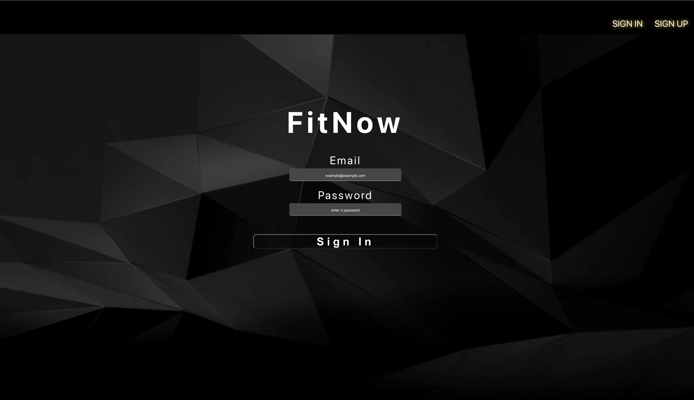
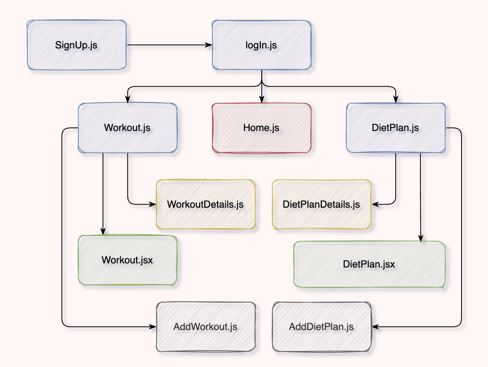

# FitNow-FrontEnd

## Date: 12 / 7 / 2022

#### By: Aekangi Patel [LinkedIn](https://www.linkedin.com/in/aekangipatel/) | [FitNow-BackEnd](https://github.com/Aekangi/FitNow-BackEnd)

### [FitNow App](https://main.d1pe52f8thbmyf.amplifyapp.com/)

---

### **_Description_**

FitNow: Your Ultimate Health Companion for Exercise and Diet Food Planning; The all-in-one health app designed to empower you on your fitness journey. With its two powerful sides—the Exercise App and Diet Food Plan—you'll have everything you need to achieve your health and wellness goals. FitNow ensures that both sides of the app work harmoniously to provide you with a holistic health experience. Seamlessly switch between the Exercise App and Diet Food Plan, and let them complement each other for optimal results Whether you're looking to shed pounds, build muscle, or simply maintain a balanced lifestyle, FitNow is your all-in-one companion for success. Get ready to unlock your full potential, harness your inner strength, and embrace a healthier, more vibrant version of yourself with FitNow – your gateway to a fit and nourished life.

---

### **_Getting Started_**

1. `Fork` and `clone`
2. Run `npm install`
3. Run `npm start`

---

### **_Technologies Used_**

- PostgreSQL
- Express
- React.js
- JavaScript
- Sequelize
- Node.js
- CSS

---

### **_Screenshots_**

---

### **_Componentent Hierarchy Diagram_**

### **_Future Updates_**

- Make User Profiles so the user can save the diet plan and workout on a single page rather than scroll through the content to find videos or plans again.
- Have a search bar to search single items.
- Add paypall so the user has to pay to view the plan. If they don't want to pay, they're able to only view the dinner for a single day.

---

#### **_Work Progress_**

[Trello Board](https://trello.com/b/A2NWRgj5/fitnow)

---

#### **_Credits_**

- Google - diet plans
- Youtube - workout videos
- [how to map videos](https://www.w3schools.com/tags/tag_video.asp)
