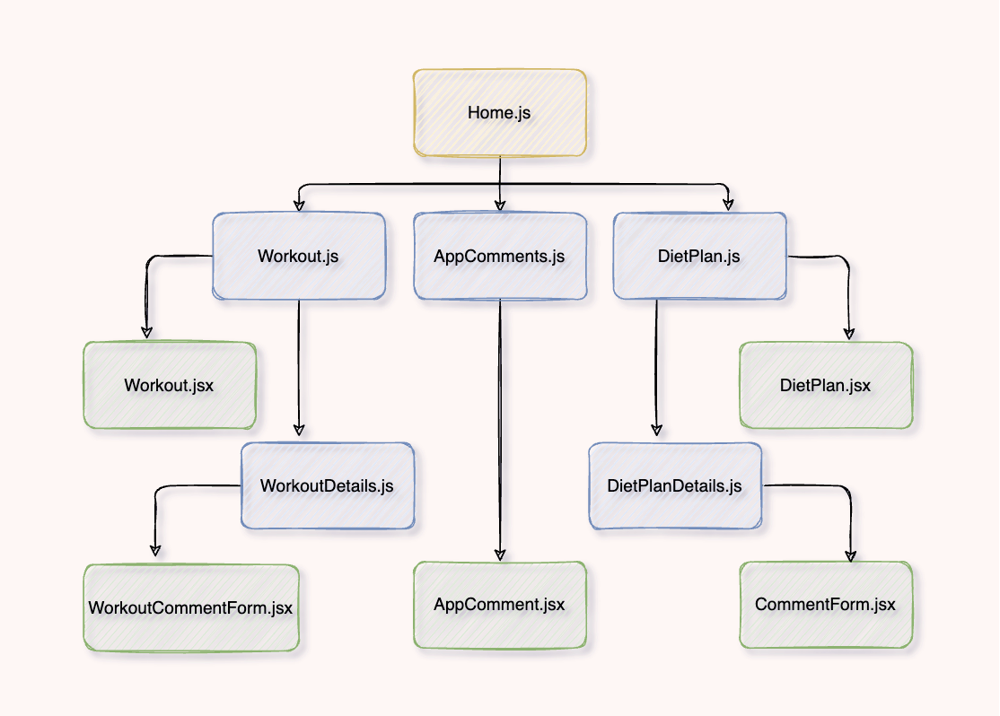

# FitNow-FrontEnd

## Date: 12 / 7 / 2022

#### By: Aekangi Patel [LinkedIn](https://www.linkedin.com/in/aekangipatel/) | [FitNow-BackEnd](https://github.com/Aekangi/FitNow-BackEnd)

### [FitNow App]()

---

### **_Description_**

FitNow is designed for those individuals that would like to get fit through exercises and diet plans. There comes a point where you would like to go on a diet but you get confused on what to eat. Worry no more! This app has well designed diet plans for each day of the week to take that confusion away.

---

### **_Getting Started_**

---

### **_Technologies Used_**

---

### **_Componentent Hierarchy Diagram_**

### **_Future Updates_**

---

#### **_Work Progress_**

[Trello Board](https://trello.com/b/A2NWRgj5/fitnow)

---

#### **_Credits_**
